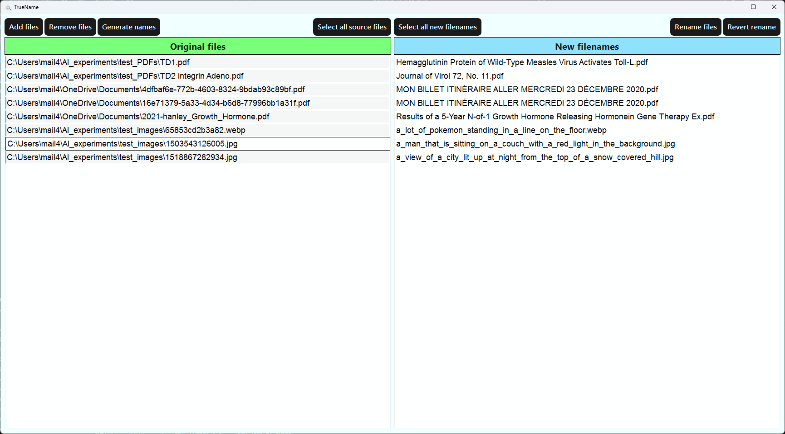

# portfolio_ml-truename
This portfolio project is part of the machine learning specialization at **Holberton School**.

## Project Presentation
**TrueName** was designed as a desktop tool for identifying, renaming and sorting documents (PDF files, images) based on their content. TrueName leverages Python's extensive array of libraries to extract data from these documents and analyze it using AI models. It then generates more meaningful filenames for easier identification of their content. Designed with both individual users and businesses in mind, TrueName serves as a valuable time-saving tool, particularly useful for swiftly identifying files with obscure or ambiguous names.

## Features
- **Content Extraction**: Extracts content from PDF and image files using AI models.
- **Automatic Filename Generation**: Automatically generates more meaningful filenames.
- **Intuitive GUI**: Provides a simple and intuitive graphical user interface for managing files and renaming.
- **Manual Editing**: Allows manual editing options for custom filenames.
- **Batch Processing**: Supports batch processing for multiple files.
- **GPU Acceleration**: Utilizes GPU acceleration with CUDA to run AI models locally for faster processing.
- **Open Files Directly**: Opens files directly from the application for quick access by double-clicking on them.

## Technologies

- **Python 3.11.7**: Python, a versatile and widely used high-level programming language, is the backbone of this project. Its simplicity and readability make it ideal for implementing complex logic, including machine learning and data analysis.

- **PyQt6**: PyQt6 provides Python bindings for the Qt framework, enabling the development of cross-platform graphical user interfaces (GUIs). It supports all major operating systems, including Windows, macOS, and Linux, and is used here to create the application’s interface.

- **PyMuPDF**: PyMuPDF is a powerful library for working with PDF files. In this project, it is utilized for extracting text from PDF documents to analyze their content.

- **transformers**: The Transformers library delivers state-of-the-art pretrained models and architectures for natural language understanding (NLU) and natural language generation (NLG). It is leveraged in this project to generate meaningful filenames by analyzing document content.

- **torch (PyTorch)**: PyTorch is a popular open-source library for machine learning, widely used in domains such as computer vision and natural language processing. Here, it is employed to load and execute AI models efficiently, with optional GPU acceleration using CUDA.


## File Descriptions
- **file.py**: Contains the main logic and functions used to manipulate files, including the models used to generate filenames.
- **main_window.py**: Manages the main graphical user interface (GUI) window of the application.
- **progressbar.py**: Used to implement a progress bar to visualize the progress of generating filenames.
- **clean_filename.py**: Provides utility functions to clean and sanitize filenames.
- **requirements.txt**: Lists all the dependencies and libraries required to install and run the project.
- **styles.qss**: Defines the styles and themes for the GUI components.
- **main_window.spec**: Used to create an executable for the application using `pyinstaller`.

## Getting Started
To get started with this project, clone the repository and install the required dependencies listed in `requirements.txt`.
This project requires Python 3.11.7 or higher.

### Setting up a Virtual Environment
1. Create a virtual environment:
    ```sh
    python -m venv venv
    ```
2. Activate the virtual environment:
    ```sh
    .\venv\Scripts\activate
    ```

3. Install the required dependencies:
    ```sh
    pip install -r requirement.txt
    ```

### Creating the Executable
To create an executable for the application, use `pyinstaller`:
1. Install `pyinstaller` if you haven't already:
    ```sh
    pip install pyinstaller
    ```
2. Create the executable:
    ```sh
    pyinstaller main_window.spec
    ```

## Usage
### Launching the Application
Either of the following methods can be used to launch the application:
- Run `python main_window.py` to directly launch the application in a Python environment.
- Run the executable generated using `pyinstaller` to launch the application as a standalone desktop tool: the executable path is `dist/TrueName/TrueName.exe`.
    - **Note**: Fair warning, the executable stays unresponsive for a while on the first launch as it downloads the required models and loads them into memory. 
    **This can take a few minutes**, depending on your internet speed and computer performance. It shouldn't be an issue on further uses, although loading the models into memory can take a few seconds on slower computers. I am planning to add a progress bar to indicate the download progress, and/or have finetuned models included in a downloadable package.

### Using the Application: Step-by-Step Guide



#### 1. Add Files
- Click the **"Add Files"** button to open the file selection dialog.
- Select the files you want to rename and click **"Open"** to add them to the list of files to used for filename generation.

#### 2. Manage the File List
- Click on individual files in the list on the left to select them.
- Use the **"Select All Source Files"** button to select all files in the list of original files.
- Remove unwanted files from the list by selecting them and clicking **"Remove Files"**.

#### 3. Generate New Filenames
- Click the **"Generate Names"** button to analyze the selected files and create meaningful filenames.
- A progress bar window will appear, indicating the status of the generation process.
- Once complete, click **"OK"** to proceed.

#### 4. Edit and Rename Files
- **Edit Names**:  
  - Double-click a generated filename to manually edit it.  
  - After editing a filename, press **Enter** to save your changes.
- **Apply Names**:  
  - Select the files you want to rename and click **"Rename Files"** to apply the new filenames.
  - Use **"Select All New Filenames"** to select all generated filenames at once.
- **Revert Changes**:  
  - To undo changes, select the files you want to revert and click **"Revert Rename"** to restore their original filenames.


## Authors
**Pierre-Emmanuel SAINT-MÉZARD**
- Github: [@Eonvorax](https://github.com/Eonvorax)
